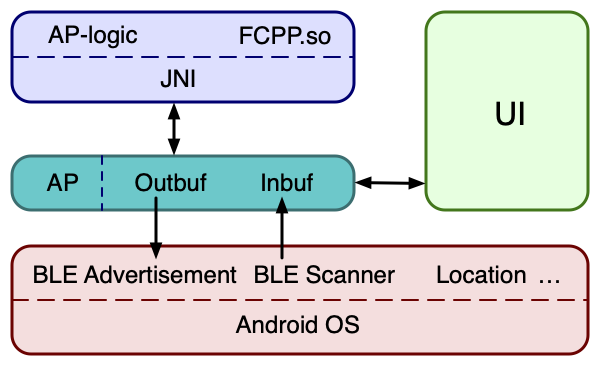
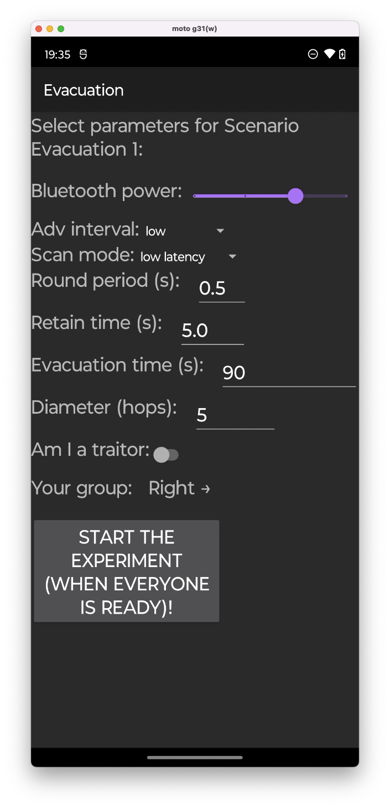
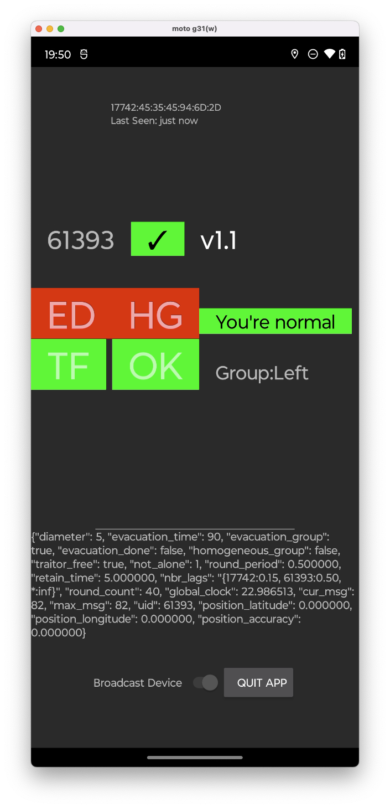

Android FCPP Sample Application
===================================

Sample demonstrating of how to implement FCPP applications that exchange data using the Bluetooth
Low Energy API (requires two or more devices to see full operation).
This code is derived from the original Apache-licensed [Android BTLE demo project](https://github.com/android/connectivity-samples/tree/main/BluetoothAdvertisements).

Introduction
------------

This project uses the Bluetooth Low Energy (BLE) [Advertisement][1] and [Scanning][2] APIs.
The functionality is split into several fragments - one for Advertising, one for Scanning, and then
an additional one with the user interface for each particular application/experiment.

[1]:https://developer.android.com/reference/android/bluetooth/le/BluetoothLeAdvertiser.html
[2]:https://developer.android.com/reference/android/bluetooth/le/BluetoothLeScanner.html

Getting Started
---------------

This project requires the `fcpp/fcpp` submodule. Either do a `git submodule update` and use the
`./gradlew build` command, or simply use "Import Project" in Android Studio which should take care of all the steps.
This image (also see the slides below) illustrates the architecture:
<figure>
  
  <figcaption><em>Figure 1: Architecture diagram</em></figcaption>
</figure>

You can run the corresponding simulations in the [`fcpp-android`](fcpp-android)-folder through `./make.sh gui run -O simulation`.

You can run the project in an emulator to look at the UI, but any Bluetooth functionality is not supported.
Please note that the code will try to send telemetry to our server.
The application contains two entry points for experiments, here we only document the Evacuation Scenario.

Evacuation Scenario
-------------------

We have implemented a simple demo, below we show the UIs for configuration, and the actual experiment:

  
  
  
<em>Figure 2a/b: Configuration screen and main UI of Evacuation experiment</em>

We have [some presentation slides](https://lambda.foldr.org/~vs/slides/2023-VORTEX-Stolz-Monitoring-Human.pdf) where we explain a bit the ideas and technology.
The "meat" of the program-logic is encoded through high-level constructs (spatio-temporal logic formulas) from our library ([jump into the code](https://github.com/fcpp/androidDemoApp/blob/c39b1094048d05b8077334fafde38d62ca2989df/fcpp-android/lib/coordination/traitor_detection.hpp#L88)).
